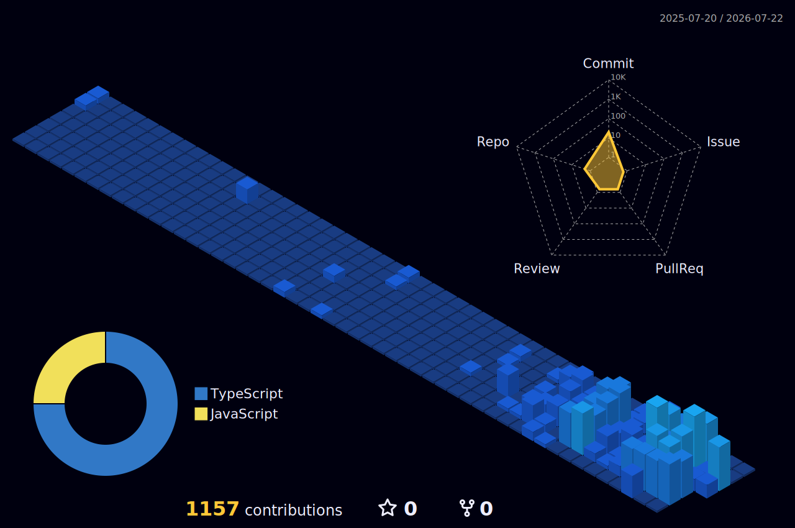

  

  

  
  
  

  
  
  
  

---

## About

<table>
  <tr>
    <td width="50%">
      <h3 align="center">Build Focus</h3>
      <pre>frontend  - React / Next.js / UI
backend   - NestJS / APIs / real-time
infra     - Docker / DB / local dev
product   - SNS / chat / task tools</pre>
    </td>
    <td width="50%">
      <h3 align="center">Style</h3>
      <pre>clean code
small iterations
usable interfaces
simple architecture</pre>
    </td>
  </tr>
</table>

## Tech Stack

  

## Featured Builds

  
  

  
  

## GitHub Stats

  
  

  
  

  

## 3D Contributions

  

  

  

  

